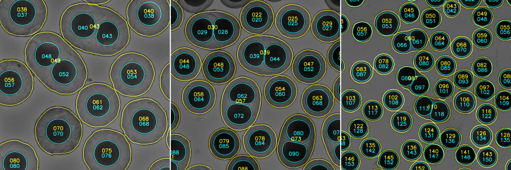

## Content

### main.py  
Processes all JPG files contained in the user-provided `data_path` folder and subfolders. Each iteration produces two CSV files (`cData.csv` and `sData.csv`) and a display image (`display.png`) saved at the location of the processed image. See [Outputs](#Outputs) section for more details.

### display.py  
Display segmentation results (outlines, labels, probabilities...) in Napari for the user-provided `data_path` and `image_name`.

### analyse.py
Compile data from different CSV files, including `tags_in` and excluding `tags_out` containing file name.

### Others
- **functions.py** - contains all required functions
- **environment-gpu.yml** - dependencies with GPU support (NVIDIA GPU required)
- **environment-nogpu.yml** - dependencies with no GPU support
- **model_weights_cores.h5** - model weights for core segmentation
- **model_weights_shells.h5** - model weights for shell segmentation

## Outputs

### display.png  
Image showing results of segmentation with detected **shells** in yellow and **cores** in cyan.



### cData.csv - inner cores data

```bash
# Core data
    - cLabel # core ID
    - cArea # area
    - cVolum # volume (assuming spherical shape)  
    - cPerim # perimeter
    - cFeret # max feret diameter
    - cMajor # fitted ellipse major axis length 
    - cMinor # fitted ellipse minor axis length
    - cSolid # solidity (object area / convex hull area)
    - cRound # roundness  
    - cCircl # circularity  
    - cY # centroid y position
    - cX # centroid x position
    - csRatio # core area / shell area
    - csDist # core to shell centroid distance

# Associated shell data
    - c_sLabel # associated shell ID
```

### sData.csv - outer shell data
```bash
# Shell data
    - sLabel # shell ID
    - sArea # area
    - sVolum # volume (assuming spherical shape)
    - sPerim # perimeter
    - sFeret # max feret diameter
    - sMajor # fitted ellipse major axis length 
    - sMinor # fitted ellipse minor axis length
    - sSolid # solidity (object area / convex hull area)
    - sRound # roundness
    - sCircl # circularity
    - sY # centroid y position
    - sX # centroid x position

# Associated core(s) data
    - sCore # number of associated core(s)
    - s_cLabel # core(s) ID
    - s_cArea # core(s) avg. area
    - s_cVolum # core(s) avg. volume
    - s_cPerim # core(s) avg. perimeter
    - s_cFeret # core(s) avg. max feret diameter
    - s_cMajor # core(s) avg. fitted ellipse major axis length 
    - s_cMinor # core(s) avg. fitted ellipse minor axis length
    - s_cSolid # core(s) avg. solidity
    - s_cRound # core(s) avg. roundness
    - s_cCircl # core(s) avg. circularity
    - s_csRatio # core(s) avg. core area / shell area
    - s_csDist # core(s) avg. core to shell centroid distance
```

```bash
# Volume = (4 / 3) * np.pi * np.sqrt(cArea / np.pi) ** 3
# Roundness = 4 * cArea / (np.pi * cMajor ** 2)
# Circularity = 4 * np.pi * cArea / cPerim ** 2
```